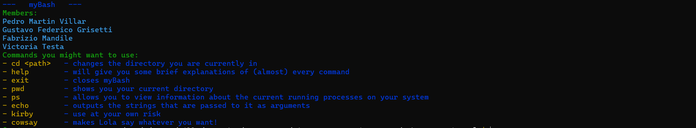

## Description
`MyBash` is an implementation of a command-line interpreter (shell) that emulates basic functionalities of the **Bourne Again Shell** (bash). This project was developed as part of the Operating Systems Laboratory 2024, with the primary goal of replicating bash's basic functionality, allowing command execution in foreground and background modes, input/output redirection, and piping between commands.

Additionally, it includes a new module, `syntax`, which suggests commands and detects similarities between the input command and allowed commands, improving the user experience in cases of typos or incomplete commands.

## Main Features
- *Command execution*: Supports execution of commands in foreground and background modes.
- *Input/Output Redirection*: Allows both input and output redirection for commands.
- *Pipes support*: Connects the output of one command with the input of another.
- *Built-in commands*: Implements `cd`, `help`, and `exit` (plus some extra commands).
- *Suggestions Module (syntax)*: Offers suggestions and detects similarities between the input command and allowed commands to prevent user errors.

## Modules
The project is organized into the following modules:

- **mybash**: Main shell module.
- **command**: Defines ADTs to represent commands (`scommand`, `pipeline`).
- **parsing**: Handles user input processing.
- **parser**: Implementation of the `parser` ADT.
- **execute**: Executes commands, managing system calls.
- **builtin**: Implements built-in commands (`cd`, `help`, `exit`).
- **syntax**: A new module that suggests and detects similarities between the input command and allowed commands, improving shell usability.

### MyBash Module

It manages the main execution loop of the command interpreter. Its function is to interact with the user, read input, interpret commands through auxiliary modules, and execute the commands using the underlying operating system. Below is the execution flow and key elements of this module:

1. Function `show_prompt()`

```c
static void show_prompt(void)
{
    const char *reset = "\x1b[0m";
    const char *green = "\x1b[32m";
    const char *blue = "\x1b[34m";
    const char *yellow = "\x1b[33m";

    char hostname[1024];
    gethostname(hostname, sizeof(hostname));
    char cwd[1024];
    getcwd(cwd, sizeof(cwd));

    time_t now;
    time(&now);
    const char *user = getenv("USER");

    printf("%s[%s at %s@%s%s %s]%s $ ",
           green, user, blue, hostname, reset, cwd,
           yellow);
    fflush(stdout);
}
```

- This function is responsible for displaying the MyBash prompt, which includes the username, host, current working directory, and the time when the prompt is generated.
- ANSI codes are used to add colors (green, blue, and yellow) to the prompt.
- The functions `gethostname()` and `getcwd()` are used to obtain the hostname and current working directory, respectively.

2. Function `main()`

```c
int main(int argc, char *argv[])
{
    pipeline pipe;
    pipe = pipeline_new();
    Parser input;

    while (true)
    {
        show_prompt();
        input = parser_new(stdin);
        pipe = parse_pipeline(input);
        // check if ctrl-d was entered, in that case close myBash
        if (parser_at_eof(input))
        {
            printf("\n");
            return EXIT_SUCCESS;
        }
        execute_pipeline(pipe);
        pipe = pipeline_destroy(pipe);
        parser_destroy(input);
    }

    if (input != NULL)
    {
        parser_destroy(input);
        input = NULL;
    }
    if (pipe != NULL)
    {
        pipeline_destroy(pipe);
    }
    return EXIT_SUCCESS;
}
```

- Show the prompt: In each iteration of the loop, `show_prompt()` is called so that the user sees the prompt and can enter a command.
- Command reading: A new instance of `Parser` is created to read the commands entered by the user from `stdin`. The command is processed using `parse_pipeline()`, which transforms the user's input into a pipeline (an abstract structure representing the entered command).
- End-of-file (EOF) check: If a `CTRL-D` (end of file) is detected, the shell terminates cleanly, returning `EXIT_SUCCESS`.
- Command execution: Commands are executed via `execute_pipeline()`, which takes the pipeline and makes the necessary system calls to execute the entered commands.
- Memory cleanup: After each iteration, the instances of `pipeline` and `Parser` created are destroyed to avoid memory leaks.

## Command Module

This module implements the abstract data types (*ADTs*) `scommand` and `pipeline`, which represent simple commands and sequences of commands (pipes), respectively. The GLib library is used to handle argument and command lists via the `GSList` structure, allowing efficient manipulation of data sequences.

### Data Structure: `scommand`

An `scommand` represents a simple command consisting of a list of arguments, an optional input redirection file, and an optional output redirection file. The structure is:
- `args`: List of arguments (GSList type).

- `in_redir`: Input redirection (optional string).
- `out_redir`: Output redirection (optional string).

### Data Structure: `pipeline`

A `pipeline` is a sequence of commands (`scommand`) connected by pipes and can be executed in the foreground or background. The structure is:

- `cmds`: List of commands (GSList of `scommand`).
- `fg`: Flag indicating whether the pipeline should be executed in the foreground (true) or background (false).

## Parsing Module

The `parsing` module is responsible for analyzing the user input in the shell, interpreting the entered commands, and transforming them into the abstract structures `scommand` and `pipeline`. The `Parser` is used to tokenize the input and classify it into arguments, input/output redirections, pipe operators, and background execution operators.

- Function `parse_scommand`: This function processes a simple command and converts the input into an instance of `scommand`, storing both arguments and possible input/output redirections.
- Function `parse_pipeline`: This function is responsible for analyzing a sequence of commands connected by pipes and converting them into an instance of `pipeline`.

## Execute Module

The `execute` module is responsible for executing commands. It handles the execution of simple commands and pipelines, including input/output redirection, process creation using `fork()`, and the execution of external commands using `execvp()`. This module is essential for the functionality of MyBash, as it executes both simple commands and complex command pipelines, redirects input/output, and coordinates created processes. Its integration with the `command`, `builtin`, and `parser` modules ensures correct command execution with the expected behavior.

## Builtin Module

The `builtin` module handles the implementation and execution of MyBash's built-in commands. These are commands that do not require the creation of an external process, such as `cd`, `exit`, and `help`. The module also includes mechanisms to detect if a command is built-in and to execute those commands.

## Syntax Module

The `syntax` module is responsible for suggesting valid commands when the user inputs an incorrect command or makes a typo. It implements an edit-distance algorithm to measure the similarity between the entered command and valid commands loaded from a file. This algorithm is based on dynamic programming techniques and uses an optimized backtracking structure.

### Function `distance_of_edition`

The `distance_of_edition` function implements the calculation of the minimum edit distance between two strings (`s1` and `s2`). Edit distance is a measure of how many operations (insertions, deletions, substitutions) are necessary to transform one string into another.

This function was initially implemented in Haskell during the first Algorithms project and later adapted to C using concepts from Algorithms II. The original backtracking solution was transformed into a dynamic programming solution to optimize performance.

## Requirements

To compile and run MyBash, the following requirements must be met:

- Compiler: GCC 9.3 or higher.
- Libraries:
    - `glib` (version 2.0 or higher) for handling sequences and lists.
    - `check` for running unit tests.

To install the dependencies:

```bash
sudo apt-get install libglib2.0-dev check
```

## Compilation Instructions

To compile the project, run the following command:

```bash
make
```

## Execution Instructions

To run the shell, use the following command:

```bash
./mybash
```
